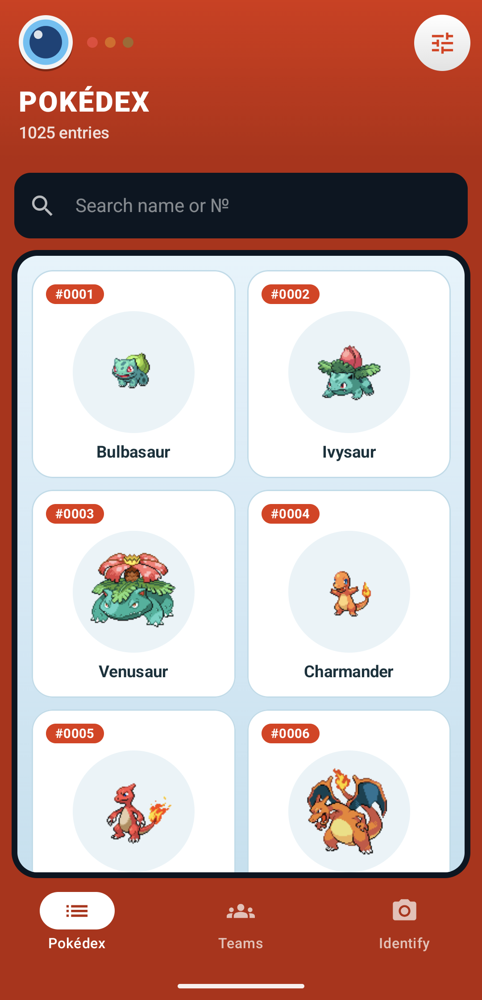
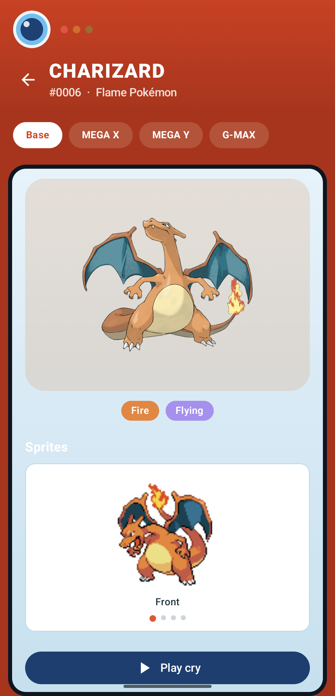
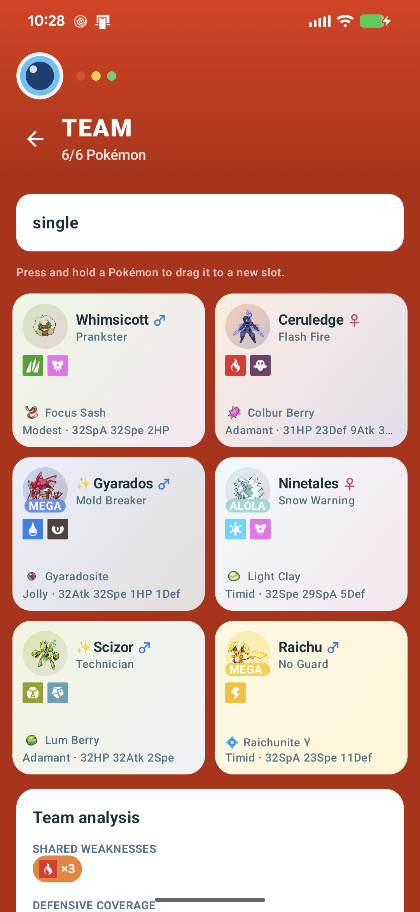
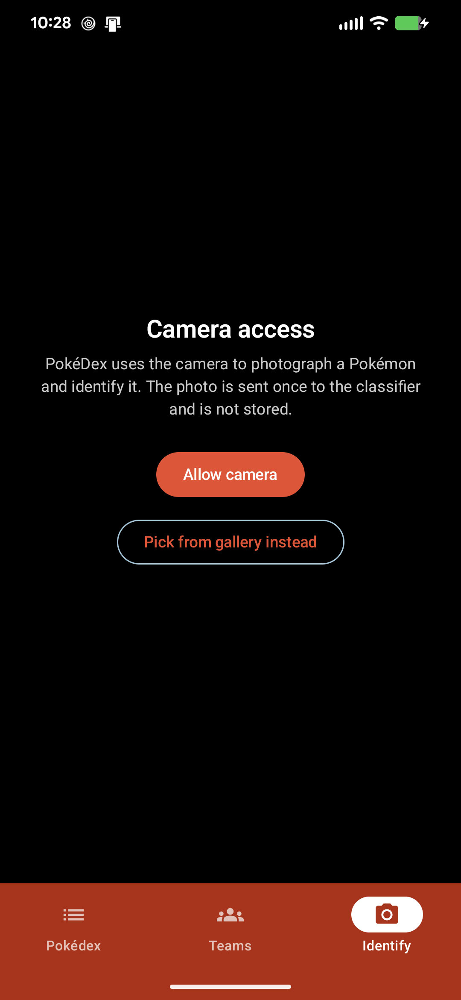

# PokéDex

A native Android Pokédex built with Kotlin and Jetpack Compose. Browse the full
National Dex, drill into rich detail pages backed by [PokeAPI](https://pokeapi.co/),
build competitive teams under the **Pokémon Champions** ruleset, and point your
camera at a Pokémon (card, plush, screenshot, drawing, costume…) to identify it
with a vision LLM.

Three bottom-nav tabs — **Pokédex**, **Teams**, **Identify** — swipeable as well
as tappable:

| Pokédex                                                                                            | Detail                                                                                  | Teams                                                                                                                                                                    | Identify                                                 |
| -------------------------------------------------------------------------------------------------- | --------------------------------------------------------------------------------------- | ------------------------------------------------------------------------------------------------------------------------------------------------------------------------ | -------------------------------------------------------- |
|                                                       |                                            |                                                                                                                               |         |
| Scrollable grid of every Pokémon with instant name/number search, type/generation filters and sort | Artwork, sprites, lore, stats, abilities, evolutions, swipeable form tabs, cry playback | Six-slot team builder: legal-species/item gating, Stat Points, Stat Alignments, swipeable forms & Mega Evolution, per-Pokémon defensive/offensive type-coverage analysis | Live camera or gallery → classified → jumps to the match |

## Requirements

* A recent Android Studio (one that supports AGP 8.13)
* JDK 17–21 — set it as Android Studio's Gradle JVM (*Settings → Build Tools →
  Gradle → Gradle JVM*), or via `JAVA_HOME` for the command line. Gradle 8.13
  doesn't support the JDK 25 that recent Android Studio bundles. To pin one, put
  `org.gradle.java.home=<path>` in your user-level `~/.gradle/gradle.properties`
  — not in the project's `gradle.properties`, since that path is
  machine-specific
* Android SDK with API 35 installed
* Runs on **Android 8.0 (API 26)** and up; compiled and targeted against **API 35**

## Setup

1. Clone the repo and open it in Android Studio (or build from the command line).
2. Create `local.properties` in the project root (Android Studio makes one
   automatically; otherwise copy `local.properties.example`):

   ```properties
   sdk.dir=/path/to/Android/Sdk
   ANTHROPIC_API_KEY=sk-ant-...
   ```

3. Build & run:

   ```bash
   ./gradlew :app:assembleDebug        # build the APK
   ./gradlew :app:installDebug         # install on a running device/emulator
   ./gradlew :app:testDebugUnitTest    # unit tests
   ./gradlew :app:connectedDebugAndroidTest   # instrumented + Compose UI tests (needs a device)
   ./gradlew :app:lintDebug            # Android lint
   ./gradlew :app:detekt               # static analysis (baseline in config/detekt/)
   ./gradlew :app:generateBaselineProfile     # regenerate the startup profile (needs a device)
   ```

   Run the instrumented tests on an emulator, not a phone with data you care
   about: Android's test runner uninstalls the app afterwards, which also removes
   its data. With several devices attached, pin the target with
   `ANDROID_SERIAL=<emulator-id>`. Debug builds install as `com.pokedex.app.debug`,
   so they sit next to a release build instead of replacing it.

### Where the API key goes

The camera-identification feature calls the **Anthropic Messages API**. The key is
**never committed**:

* Put `ANTHROPIC_API_KEY` in `local.properties` (git-ignored).
* `app/build.gradle.kts` reads it at configure time and exposes it as
  `BuildConfig.ANTHROPIC_API_KEY` (it also falls back to an `ANTHROPIC_API_KEY`
  environment variable, which is handy for CI).
* If the key is missing the app still builds and every other feature works; the
  Identify screen just shows a "No Anthropic API key configured" error with a
  retry button.

Get a key at <https://console.anthropic.com/>. The classifier uses model
`claude-sonnet-4-6` (see `AnthropicPokemonClassifier.MODEL`).

### First run

1. The first launch needs a network connection: the Pokédex grid and every detail
   page are fetched from PokeAPI and cached in Room, so after that it browses
   offline. Search by name or number, or filter by type and generation.
2. Open the **Teams** tab → **New team**, then tap an empty slot to add a Pokémon.
   Only species and items legal under the Champions ruleset are offered. Long-press
   and drag to rearrange Pokémon within a team, or teams in the list.
3. Tap a filled slot to set its ability, nature, item, Stat Points and moves; the
   coverage analysis under the grid updates as you go.
4. Export a backup from the ⋮ menu on the Teams header so the teams survive an
   uninstall or a new phone. The same menu has *Delete all data* (you'll be asked
   to type `DELETE`).
5. Optional: add an `ANTHROPIC_API_KEY` (see above) to use the **Identify** tab.
   Without one the rest of the app works and Identify explains what's missing.

## Features

* **Pokédex** — scrollable grid of every Pokémon with instant name/number search,
  type/generation filters and sort.
* **Detail pages** — artwork, sprites, lore, stats, abilities, evolutions
  (including regional trees), swipeable form tabs and cry playback. See
  [Evolution chains](#evolution-chains) and [Cry playback](#cry-playback).
* **Team builder** — six-slot teams under the **Pokémon Champions** ruleset:
  legal-species/item gating, Stat Points and Stat Alignments, swipeable forms and
  Mega Evolution, search by move, drag-to-reorder, copy a Pokémon between teams,
  export/import/delete all your teams, and per-Pokémon
  defensive/offensive type-coverage analysis. See
  [Team builder](#team-builder) and [Backup & restore](#backup--restore).
* **Camera identification** — point the camera at a Pokémon (card, plush,
  screenshot, drawing, costume…) or pick from the gallery; a vision LLM
  identifies it and jumps to the match. See
  [Camera identification](#camera-identification).
* **Offline-first** — Room caches the Dex and every detail response
  (stale-while-revalidate), and every screen has loading / empty / error states
  with retry.
* **Swipeable tabs** — the three main screens live in a `HorizontalPager` behind
  the bottom nav, so a swipe and a tap move between them in sync.

## Architecture

MVVM + a repository layer, Hilt for DI, coroutines/Flow throughout, single-Activity
Compose with Compose Navigation and a bottom navigation bar.

```
app/
  ui/
    list/        Pokédex grid + search/filter/sort
    detail/      Detail page (artwork, sprites, stats, abilities, evolution, form tabs)
    team/        Teams list + six-slot editor (TeamEditorScreen = entry + shared drag
                 gesture, TeamGrid = slot grid, MemberEditor = per-Pokémon editor,
                 AnalysisCard = coverage report), pickers, stat hexagon
    camera/      CameraX capture + identify flow
    result/      "Not a Pokémon" result screen
    navigation/  NavHost + Routes + bottom bar (the three main tabs are pages of a
                 single `HorizontalPager` behind the bar, so a swipe and a tap
                 both move between them in sync; Detail/TeamEditor/Result are
                 separate pushed routes on top)
    components/  Shared Compose (headers, type chips/symbols, screen states)
    theme/       Material 3 palette + type colors
  domain/
    model/       Plain UI-facing models (PokemonDetail, FormsBundle, …)
    team/        Champions rules: TeamModels, ChampionsLegal, CompetitiveItems,
                 TypeChart, TeamAnalysis (all pure Kotlin)
  data/
    remote/      Retrofit services + DTOs, RetryInterceptor (PokeApiService, anthropic/AnthropicService)
    local/       Room database, DAOs, entities, PokeDexMigrations — Pokédex cache + saved teams
    classifier/  PokemonClassifier interface + AnthropicPokemonClassifier + ClassificationParser
    repository/  PokemonRepository / TeamRepository (+ Impls) — cache-first, stale-while-revalidate
    Mappers.kt   DTO → domain
    TeamBackup.kt  Saved-teams JSON backup format + validating parser
  core/          Pure helpers: PokemonNames, PokemonForms, FlavorText, ImageScaling,
                 Sprites (PokéAPI URL builder), Resource
  di/            Hilt modules (Network, Database, App/Repository/Classifier bindings)
baselineprofile/ com.android.test module that generates the startup profile
```

### Stack

| Concern         | Choice                                                                                               |
| --------------- | ---------------------------------------------------------------------------------------------------- |
| Language        | Kotlin                                                                                               |
| UI              | Jetpack Compose + Material 3, Compose Navigation, three swipeable tabs behind the bottom bar         |
| Architecture    | MVVM + Repository, unidirectional `StateFlow`                                                        |
| DI              | Hilt                                                                                                 |
| Persistence     | Room — the disposable Pokédex cache and the user's saved teams, in one database                      |
| Networking      | Retrofit + OkHttp + kotlinx.serialization, with a retrying interceptor for the PokeAPI client        |
| Images          | Coil (128 MB disk cache) plus bundled type-symbol drawables                                          |
| Camera          | CameraX                                                                                              |
| Backup          | kotlinx.serialization JSON through the system file picker (saved teams only)                         |
| Identification  | Anthropic Messages API (vision), optional — the app works without a key                              |
| Tests           | JUnit, Turbine, MockK, Truth, Room `MigrationTestHelper`, Compose UI tests                           |
| Tooling         | detekt, AndroidX Baseline Profile + Macrobenchmark                                                   |

`applicationId` / `namespace` = `com.pokedex.app` (debug build is `.debug`).
`minSdk 26`, `compileSdk` / `targetSdk 35`.

### Toolchain

|                       | Version                                                                                                                                |
| --------------------- | -------------------------------------------------------------------------------------------------------------------------------------- |
| Android Gradle Plugin | 8.13.2                                                                                                                                 |
| Gradle wrapper        | 8.13                                                                                                                                   |
| Kotlin / KSP          | 2.0.21 / 2.0.21-1.0.28                                                                                                                 |
| Compose BOM           | 2024.10.01                                                                                                                             |
| JDK                   | 17–21 (Gradle 8.13 doesn't support the JDK 25 that recent Android Studio bundles, so point Gradle at a JDK 17–21 — see *Requirements*) |

Every library version is pinned in `gradle/libs.versions.toml`.

### Rate limiting & retries

* **Two clients.** Retrofit + OkHttp + `kotlinx.serialization`, with one Retrofit
  instance for PokeAPI and one for the Anthropic API (a separate `OkHttpClient`
  that injects `x-api-key` / `anthropic-version` headers).
* **Retries.** The PokeAPI client adds a `RetryInterceptor` (exponential backoff
  + jitter on `429` / `5xx` / network errors) because the team builder fans out
  many small requests at once.
* **Bounded fan-out.** The heaviest case is the move-search filter, which can
  check 200+ candidate Pokémon for one query; `pokemonIdsOfMove` throttles that
  through a `Semaphore` rather than firing every request at once.

### Offline behaviour

* **Images** — Coil, with a 128 MB disk cache configured in `PokeDexApplication`
  so sprites and artwork survive offline. The 18 Scarlet/Violet type-symbol icons
  are bundled as `drawable-nodpi` resources (the team-analysis screen draws a few
  hundred at once, so a network image loader per instance was measurable jank).
* **Caching / offline** — Room stores the Dex index in its own table (search is a
  local query) and every detail/species/evolution/ability/move/item response as a
  raw JSON blob keyed by a stable cache key. `observePokemonDetail` emits the
  cached bundle immediately, then refreshes in the background and re-emits; on
  network failure it keeps showing cache plus an error. The species/pokemon
  lookups behind the team builder's forms (`getFormsBundle`, `getPokemon`) and
  `getEvolutionChain` instead revalidate against the network once a cached entry
  is more than 24h old, falling back to the stale copy only if that refetch
  fails — Champions is a live, still-updating game (new Mega Evolutions, balance
  changes, …), so a response cached forever could go permanently stale, as
  happened with an early, incomplete PokéAPI snapshot of Mega Golisopod's
  ability. Saved teams (`team` / `team_member`) are user data, not cache — the
  schema is versioned (JSONs in `app/schemas/`) and a destructive fallback is
  only allowed *from version 1*; see `PokeDexMigrations` and "Known limitations".
* **Cache-key versioning** — a cached entry stores the re-serialized DTO, not
  the raw response body, so adding a field to a DTO (`version_group_details`
  on `MoveSlotDto`, `learned_by_pokemon` on `MoveDto`) doesn't retroactively
  appear in what's already on disk. `PokemonRepositoryImpl` bumps that entry's
  cache key (`pokemon/v2/…`, `move/v4/…`) whenever this happens, so a stale
  pre-existing cache is simply orphaned and re-fetched instead of silently
  decoding to the new field's default.
* **Loading states** — every screen has loading / empty / error states with
  retry, and progressively-loaded views fill in per item: team slots and Pokédex
  cards render a spinner until their data arrives, and `SpriteImage` shows one
  over any individual sprite/artwork still being fetched by Coil, rather than
  showing a blank or half-populated card.

### Cry playback

`MediaPlayer` streams `cries.latest`, falling back to `cries.legacy`.

### Evolution chains

PokéAPI folds regional varieties into the base species' chain and tags the
regional methods with `base_form` / `evolved_form`. `EvolutionNode` reconstructs
the per-region tree from those tags (`regionForms`, `leadsToRegion`,
`visibleChildren`, `methodFor`) so a form tab like *Alolan Raichu* shows
`Pichu → Pikachu → (Thunder Stone) → Alolan Raichu`, keeping intermediate stages
that have no regional form of their own.

### Team builder

Models the **Pokémon Champions** competitive format (Regulation M-C), all in
pure Kotlin under `domain/team/`:

* **`ChampionsLegal`** — the legal-species allow-list and the 166-item legal
  list. Illegal Pokémon and items are shown greyed with a 🚫 marker rather than
  hidden. Moves are **not** gated by us: Champions restores moves from every
  past generation (Zap Cannon on Raichu, …), and PokéAPI has its own
  authoritative `train` move-learn-method (added for Champions v1.0, mined
  from the game's own files) that already encodes exactly that — including
  moves a species knows in older games but that are disabled in Champions
  (Tsareena knows Magical Leaf, but it's unusable there). `Mappers.movePoolFor`
  prefers `train`-tagged moves when PokéAPI has populated them for a species,
  falling back to the older "every move from any game" union — patched for
  specific known PokéAPI gaps via `MOVE_POOL_PATCHES` (e.g. Golisopod's
  U-turn and Aqua Jet), only in that fallback branch, never on top of `train`
  data — for species PokéAPI hasn't reached yet.
* **Search by move** — the "Add Pokémon" sheet's search field toggles between
  Name and Move. Move search first gets a cheap candidate list from PokéAPI's
  `/move/{name}` endpoint (`learned_by_pokemon`), then — since that reverse
  index carries no per-entry learn-method info — verifies each candidate the
  same Champions-accurate way as above (`PokemonRepositoryImpl.pokemonIdsOfMove`),
  so a move that's disabled in Champions for a given species (Magical Leaf on
  Tsareena, again) correctly excludes it from the results too.
* **`CompetitiveItems`** — held-item catalogue (staples, choice, berries, ~80
  Mega Stones incl. Champions-only ones). Carries an `apiSlug` for items PokéAPI
  names differently (Leek → `stick`) and a bundled `blurb` for the many Gen
  VIII/IX items PokéAPI has no sprite or effect text for. When PokéAPI has no
  icon at all yet — true for several of the newest Champions-only Mega Stones,
  e.g. Raichunite Y, which PokéAPI already lists but hasn't published art for —
  `heldItemFallbackGlyph` shows a category-appropriate placeholder (💠 for a
  Mega Stone, 🍒 for a berry) instead of a generic bag, and swaps in the real
  sprite automatically the moment PokéAPI publishes one.
* **`StatCalc`** — Level 50, 31 IVs, 66 Stat Points (max 32/stat), 21 "Stat
  Alignments" (renamed natures).
* **Forms** — regional forms (Alolan, Galarian, …) are a first-class, persisted
  choice; Mega Evolution is driven entirely by the equipped Mega Stone.
* **`TeamAnalysis`** — per-Pokémon defensive and offensive type coverage,
  including ability-based immunities (Flash Fire, Levitate, Lightning Rod, …) and
  counting base + Mega type combos separately.
* **Reordering** — press-and-hold a slot in the grid, a move in a Pokémon's
  editor, or a team in the Teams list, to drag it onto another and swap their
  positions (`tapOrDragToReorder` in `TeamEditorScreen.kt`;
  `TeamEditorViewModel.swapSlots` / `swapMoves`; `TeamListViewModel.swapTeams`
  persisting to `team.sortOrder`, the list's manual position independent of
  `updatedAt`). A TalkBack user gets the same capability via a "Move
  up/down/left/right" custom accessibility action on each item, since the drag
  itself is touch-only.
* **Reuse across teams** — the "Add Pokémon" sheet can also copy an
  already-built Pokémon from one of your other saved teams in as an independent
  starting point (`TeamEditorViewModel.addFromMember`); editing it afterward
  never touches the team it came from.
* **Swipeable forms** — a member's profile card (`MemberEditor.kt`) is a
  `HorizontalPager` over its forms, so swiping between Base / Mega / regional
  works the same as tapping the pill tabs — settling on a new page commits it
  for real (equipping/removing the Mega Stone, swapping the movepool, …), same
  as a tap. The Pokédex detail screen's regional-form tabs are swipeable the
  same way.
* **Deleting a team** asks for confirmation first, since it removes every
  Pokémon in it and can't be undone.
* **Enrichment races** — placing a Pokémon (or reloading a saved team) kicks
  off a network fetch to fill in its types/stats/abilities/forms; the user can
  keep editing, swapping slots, or replacing that Pokémon while it's still in
  flight. `TeamEditorViewModel.applyEnrichment`/`ensureForms` resolve the
  *current* member by species id (not the slot the fetch started for) before
  writing anything back, so a swap mid-fetch follows the Pokémon to its new
  slot instead of stranding the result, and a fetch that fails leaves the
  existing data alone rather than nulling out a saved ability.

Saved teams live in Room (`TeamDao` / `TeamEntities`) — real user data, distinct
from the disposable Pokédex cache. The Teams list is ordered by `team.sortOrder`
(manual, set by drag-reordering; a new team is placed first), not by last-edited
time, so editing a team never moves it. See "Known limitations" below.

### Backup & restore

The Teams header's ⋮ menu has *Export backup*, *Import backup* and *Delete all
data*. Export and import go through the system file picker (no storage permission
needed), so the file can go to Drive, email, or another device. It is named
`pokedex-backup-<date>.json` by default.

* **What's in the file** — every saved team, in on-screen order, with each
  Pokémon's species, form, ability, nature, item, shiny, gender, Stat Points and
  moves. The Pokédex cache isn't included; it's re-fetched on demand.
* **Format** — one JSON document with `app`, `version` and `exportedAt` headers
  (`TeamBackup.kt`, written with the `kotlinx.serialization` the app already uses).
  Gender, shiny and form are their own fields rather than Room's packed
  `teraType` / `level` columns, so the file doesn't depend on that storage
  shortcut. Fields added in later versions are optional, so older backups still
  import.
* **Import replaces, and is all-or-nothing** — `TeamBackup.parse` validates the
  whole file first (right app, not from a newer version, at most six Pokémon per
  team, valid and unique slots, no species twice in a team, Stat Points and moves
  within the game's limits) and only then replaces every saved team in one Room
  transaction (`TeamDao.replaceAllTeams`), after a confirmation. A rejected file
  changes nothing and the snackbar says why. Files over 10 MB are refused while
  they're being read, so a wrong (huge) file can't exhaust memory; a real backup is
  a few hundred KB at most.
* **Delete all data** — removes every saved team and its Pokémon in one Room
  transaction (`TeamRepository.deleteAllTeams`). Because that can't be undone, the
  confirmation dialog keeps its button disabled until the user types `DELETE`
  (case and surrounding spaces ignored, so a keyboard's auto-capitalisation
  doesn't get in the way). The item is greyed out when there are no teams. The
  Pokédex cache isn't touched; it isn't user data and is re-fetched on demand.
* **Not covered** — automatic or scheduled backup: it's a manual export, and the
  file is plain, unencrypted JSON. `allowBackup` is on, so Android's own cloud
  backup and device transfer also carry `pokedex.db`, but that depends on the
  phone's settings and isn't a substitute for an exported file.

### Camera identification

1. CameraX (`LifecycleCameraController`) live preview + capture, or pick from the
   gallery. `CAMERA` is requested at runtime with a rationale screen and a
   graceful permanently-denied path ("Open settings").
2. The image is downscaled to ≤ 1024 px on the long edge, re-encoded as JPEG,
   base64-encoded (`core/ImageScaling.kt`).
3. `PokemonClassifier` (interface — swap in an on-device TFLite model later) sends
   it to `claude-sonnet-4-6` as a base64 image block with a strict
   JSON-only system prompt.
4. `ClassificationParser` extracts the first balanced `{…}` object even through
   code fences / prose, and tolerates malformed or wrongly-typed fields.
5. If it's a Pokémon with confidence ≥ 0.5, the name is normalized
   (`PokemonNames`: `Mr. Mime` → `mr-mime`, `Nidoran♀` → `nidoran-f`, `Flabébé` →
   `flabebe`), resolved to a Dex id, and the detail screen opens with an
   "Identified: … (NN% confident)" banner. Otherwise the result screen shows a
   friendly "that's not a Pokémon" card with the model's reason and a Try again.

## Theming

Material 3 with dynamic color on Android 12+, a red/white Pokédex-inspired accent
palette as the fallback, full dark-mode support, and type-colored chips/headers.

## Tests

Unit (`./gradlew :app:testDebugUnitTest`, 154 tests):

* `PokemonNamesTest` / `FlavorTextTest` / `PokemonFormsTest` — `core/` helpers
* `SpritesTest` — the PokéAPI sprite-URL builder
* `PokemonSummaryTest` — `displayName` title-casing, gender-segment stripping
* `ClassificationParserTest` — identify-JSON parsing: fences, prose, percentages,
  `"null"`, malformed input
* `PokemonRepositoryImplTest` — index refresh filtering, name resolution, the
  legacy-cache-key regression (a pre-Champions cache entry gets refreshed
  rather than silently trusted), and `pokemonIdsOfMove` only returning species
  where the move is actually Champions-legal (MockK)
* `MappersTest` — `movePoolFor`'s train-preferred/fallback/patch logic,
  including that a patch never overrides real `train` data
* `RetryInterceptorTest` — retry / backoff / give-up behaviour on a fake chain
* `TeamModelsTest` — `StatCalc` formula, Stat Alignments, `Gender`, SP helpers
* `ChampionsLegalTest` — species and item legality
* `TeamAnalysisTest` — defensive / offensive type coverage, ability immunities,
  base-vs-Mega handling, speed order, shared weaknesses
* `CompetitiveItemsTest` — `apiSlug` / `blurb` / sprite fallbacks, Mega-Stone helpers
* `EvolutionChainTest` — regional-variety evolution reconstruction: Alolan lines,
  per-region branch selection, intermediate stages with no regional form, and the
  plain-vs-regional method split (`base_form` set even on the standard line)
* `TeamEditorVerificationTest` — the enrichment-race guards above: an edit or a
  slot swap made while a fetch is in flight survives, a swapped member's forms
  still load at its new slot, and a failed fetch doesn't clear a saved ability
* `PokemonPickerVerificationTest` — leaving Move search for Name mode clears a
  cancelled search's "checking…" state and a failed search's error, rather than
  leaving either stuck on screen
* `TeamBackupTest` — the backup format round-trips every persisted field and the
  team order, tolerates missing optional fields and unknown keys, and rejects
  non-backups, other apps' files, newer versions, bad or duplicate slots, duplicate
  species and out-of-range Stat Points or moves; a file over the size limit is
  refused while reading, and one exactly at it is accepted
* `TeamListViewModelTest` — `swapTeams` delegates to the repository, and is a
  no-op for two equal ids; export writes the repository's JSON to the chosen
  file, and import reports a restore, an invalid or oversized file (with the
  reason) or an unreadable one without touching the repository; `deleteAllTeams`
  asks the repository to delete everything and reports a database failure
* `DeleteConfirmationTest` — the typed phrase matches `DELETE` in any case with
  surrounding whitespace, and nothing else

Instrumented (`./gradlew :app:connectedDebugAndroidTest`, 16 tests):

* `PokemonListSearchTest` — typing in the search box filters the grid
* `MigrationTest` — the current Room schema opens from scratch and through the
  real database builder, and `MIGRATION_2_3` backfills `team.sortOrder` to
  match each team's pre-migration rank by `updatedAt`
* `TeamDaoTest` — `swapSortOrder` actually exchanges two teams' positions
  rather than collapsing both onto the same value, a real-SQLite regression
  test (see `TeamDao.swapSortOrder`'s doc comment for why a single `CASE`-based
  `UPDATE` can't be trusted to do this correctly)
* `TeamBackupRoundTripTest` — against real Room: an exported backup restores
  into a fresh database including the packed gender / shiny / form columns,
  importing replaces the old teams and their members without orphans, an
  invalid file leaves existing teams untouched, and deleting all teams removes
  their members too
* `TeamsListScreenTest` — drives real Compose touch input (not a mock of the
  gesture) against the Teams list: a second drag on a row that already moved
  once uses its *current* position rather than the one its `pointerInput`
  coroutine was first launched with, and an ordinary swipe that starts on a
  row still scrolls the list instead of being swallowed by the reorder
  gesture's touch handling; and *Delete all data* stays disabled until `DELETE`
  is typed, then removes every team, is cancellable, and is greyed out when
  there are no teams

## Static analysis & performance

* **Android lint** (`./gradlew :app:lintDebug`) — no errors.
* **detekt** (`./gradlew :app:detekt`) runs against `config/detekt/detekt.yml`
  with a baseline (`config/detekt/baseline.xml`) — existing findings are frozen,
  new ones fail the task. Regenerate the baseline with `:app:detektBaseline`.
* **Baseline Profile** — the `:baselineprofile` module drives a cold start + grid
  scroll + detail + tab switch and writes `app/src/release/generated/
  baselineProfiles/`, which `assembleRelease` bakes into the APK
  (`assets/dexopt/`). Regenerate with `:app:generateBaselineProfile` on a device.
* **Release signing** — `release` (and the plugin's `nonMinifiedRelease` /
  `benchmarkRelease` variants) is signed with your own key when a git-ignored
  `keystore.properties` exists in the project root (copy
  `keystore.properties.example`: `storeFile`, `storePassword`, `keyAlias`,
  `keyPassword`), and falls back to the debug key when it doesn't, so a fresh
  clone still builds and installs. An incomplete file fails the build with a
  message naming the missing key. `*.jks`, `*.keystore` and `keystore.properties`
  are git-ignored. Android only updates an installed app in place when the new
  build has the *same* signing key, so switching keys later means uninstalling
  first — which deletes the app's data, so export a backup beforehand.

## Known limitations / TODO

* **DB migrations** — from version 2 on, a schema change needs a real `Migration`
  in `PokeDexMigrations` (destructive fallback is only allowed from version 1, so
  a missing migration fails loudly instead of wiping saved teams). Two columns are
  still reused to dodge a bump — `team_member.teraType` packs `"<gender>|<formSlug>"`,
  `team_member.level` packs the shiny flag — a future migration should un-pack
  them (`MIGRATION_2_3` only added `team.sortOrder`). Splitting the disposable
  cache into its own database would be cleaner still.
* **Backups are manual** — the app has no automatic or scheduled export. Android's
  own cloud backup / device transfer carries `pokedex.db` (teams and cache
  together) when the phone has it enabled, but that's outside the app's control,
  so export a file from the Teams tab before uninstalling or changing phones. See
  [Backup & restore](#backup--restore).
* **`ChampionsLegal` is a static snapshot** — the species/item allow-list is
  hand-curated for the current regulation (Reg M-C, Sept–Dec 2026) rather than
  fetched from anywhere, so it won't update itself when the regulation rotates;
  someone has to refresh `ChampionsLegal.SPECIES` / `ITEMS` by hand at that point.
* **Accessibility** — icon-only controls and the hero artwork are labelled, but
  the coverage grids read as a stream of type names rather than a spoken summary.
* **Classifier model** — `claude-sonnet-4-6`; newer models are available.
* **No CI** — a workflow running `detekt` + `testDebugUnitTest` + `lint` +
  `assembleDebug` would catch regressions.

## Legal

Copyright (c) 2026 phxlin. All rights reserved.

This is an unofficial fan project. It is not affiliated with, endorsed by, or
sponsored by Nintendo, Game Freak, or The Pokémon Company. Pokémon and Pokémon
character names are trademarks of their respective owners, and all related
names, sprites, and artwork belong to them; the copyright notice above covers
only this project's own code. Data is fetched from [PokéAPI](https://pokeapi.co).
